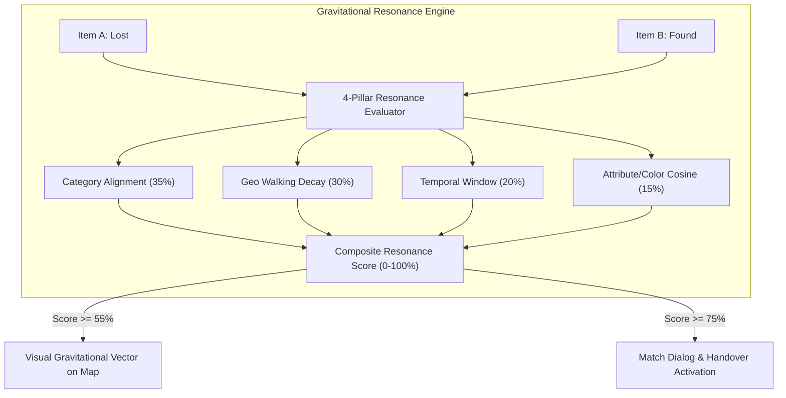
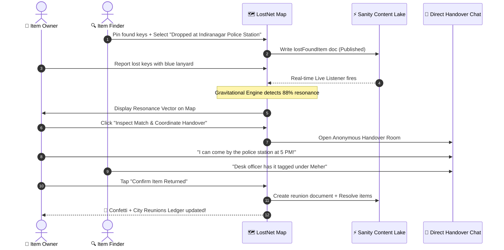
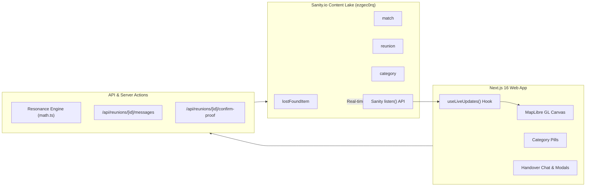

*This is a submission for the [Sanity Challenge, Path Two: Vibe-Code Something Strange](https://dev.to/challenges/sanity-2026-09-16)*

---

## What I Built

**LostNet** is a real-time, map-first neighborhood Lost & Found network where lost items gravitationally pull toward their finders.

Set in a bustling city neighborhood (Indiranagar, Bengaluru), LostNet operates as zero-friction public infrastructure: **no account, sign-up, or password required**. If you drop your keys or find a phone at a bus stop, you can report it in 15 seconds directly from your phone.

A deterministic **Gravitational Resonance Engine** continuously evaluates spatial, temporal, and semantic similarity across four distinct pillars:
- **Category Match (35%)**: Strict taxonomy alignment (Keys, Phone, Wallet, Pets, etc.)
- **Geo Proximity (30%)**: Inverted exponential decay based on neighborhood walking radius
- **Time Window (20%)**: Chronological plausibility (e.g., found *after* lost within a 60-hour window)
- **Attribute & Description Similarity (15%)**: Color, material tags, and textual cosine matching



---

### What makes it "Strange"?

Most lost-and-found software tries to build an airline ticketing desk on the web: multi-step account creation, complex ticket IDs, KYC verification, and bureaucratic hurdles.

**LostNet models how humans actually behave in a city.** When people find lost belongings, they do one of three things:
1. 🏛️ **Drop it at known civic infrastructure** (local police station reception, metro customer desk, café counter)
2. 🤲 **Keep it safe** while waiting for verified contact
3. 📍 **Leave it undisturbed** at the exact spot

LostNet embeds these real-world drop-offs directly into the content lifecycle, paired with an **anonymous direct coordination chat** so owners and finders can safely arrange pickups without exchanging personal phone numbers.



---

## Demo

- 🌐 **Live Application**: [https://lostnet.vercel.app](https://lostnet.vercel.app)
- 💻 **GitHub Repository**: [https://github.com/ANSUJKMEHER/LostNet](https://github.com/ANSUJKMEHER/LostNet)

### Autonomous Guided Tour (Interactive In-App Demo)

Rather than forcing visitors to watch a pre-recorded clip or manually create dummy items, LostNet includes a built-in **Auto-Demo Mode** directly in the UI. 

Clicking **"Auto Demo"** in the top navigation activates an automated 3-stage camera choreography:
1. **Stage 1 (Resonance Animation)**: Automatically focuses the map on a high-resonance lost/found pair and animates the gravitational vector pulling them together.
2. **Stage 2 (Inspection)**: Slides open the match proposal showing confidence breakdowns, distance, and the finder's physical handover location.
3. **Stage 3 (Reunion Flow)**: Steps through the handover confirmation, fires celebratory particle physics, and logs the completed handover to the public ledger.

### Screenshots

| Interactive Resonance Map | 4-Pillar Match Verification | City Reunions Ledger |
| :---: | :---: | :---: |
|  |  |  |

---

## Architecture & Real-World Handover Design



### The Anonymous Handover Chat

One of the key lessons during development was that strangers don't want to sign up or give out WhatsApp numbers to coordinate returning lost items. 

LostNet introduces ephemeral, anonymous chat sessions bound to match pairs:
- **Instant Meeting Chips**: Quick-send preset chips (*"Can we meet near 100 Feet Road?"*, *"I have the item safely with me"*, *"Left at front desk"*).
- **Mutual Safety**: Zero personal contact info required.
- **Proof-of-Return Verification**: Once returned, either party can mark the handover complete, triggering the reunion record on Sanity.

---

## Sanity Project Details

- **Sanity Project ID**: `ezgec0rq`
- **Dataset**: `production`

LostNet treats Sanity not just as a static CMS, but as a live, structured civic ledger. The schema is organized into 5 primary document types:

```plaintext
src/sanity/schema.ts
├── category         # Taxonomic tags, emoji representations, and search aliases
├── lostFoundItem    # Geopoints, occurredAt, colors, materials, drop-off handover notes, status lifecycle
├── match            # Multi-document reference (itemA + itemB), score breakdown (category, geo, time, text)
├── reunion          # Confirmed returns, public celebration story, anonymous chat transcripts
└── settings         # Dynamic neighborhood radius (km), time window tolerance, confidence thresholds
```

### Real-Time Live Sync with Sanity `listen()`

When an item is reported or resolved, other open screens reflect the update in real-time without refreshing:

```typescript
// src/hooks/use-live-updates.ts
const subscription = client
  .listen('*[_type in ["lostFoundItem", "match", "reunion"]]')
  .subscribe((update) => {
    // Debounced callback to refresh map pins and resonance vectors
    onUpdate();
  });
```

### Clean Provider Abstraction
All data operations sit behind a unified interface (`src/lib/data/provider.ts`). Setting `DATA_PROVIDER=sanity` in the environment points mutations and GROQ projections directly to Sanity's Content Lake:

```groq
*[_type == "lostFoundItem" && status != "resolved"] {
  _id,
  kind,
  title,
  description,
  placeLabel,
  "location": { "lat": location.lat, "lng": location.lng },
  occurredAt,
  colors,
  materials,
  status,
  imageUrl,
  handoverNote,
  "category": category->title
}
```

---

## My Build Process

### The AI-Native Pair Programming Loop
I built LostNet using **Google Antigravity IDE**, working in a continuous pair-programming loop with its agentic coding engine.

### The Great Workflow Pivot: From Crypto-Nonsense to Human Reality

The most memorable moment during the build was when the code was technically "flawless", but the product was unusable in real life.

Initially, an over-engineered cryptographic handover system was generated:
- Owners had to set a secret question ("What color is the lanyard?").
- The server generated random salts and stored PBKDF2-SHA256 hashes.
- Finders had to input the claimant's answer into a simulated "Custody Desk" modal.
- The system generated QR code "Return Passes" styled like airline boarding passes.

It was impressive engineering, but when tested against common sense, a fundamental question arose: **Who finding keys on a rainy sidewalk is going to quiz a stranger on cryptographic hashes or scan an airline boarding pass at a coffee counter?**

A direct pivot prompt transformed the direction:
> *"don't just see the code problem, I think there is a workflow problem which doesn't happen in real life. The main part is handover — keep it very simple: kept in police station, or decided at place. Think of a way normal humans will actually use this."*

That single reality-check reshaped the entire architecture:
- ✂️ **Removed**: Custody desk gatekeeping, PBKDF2 challenge hashes, and digital boarding passes.
- 🛠️ **Introduced**: 1-tap real-world drop-off categories (`Dropped at known desk/police station`, `Holding safe`, `Left at spot`).
- 💬 **Added**: Lightweight, anonymous in-browser chat with 1-click meeting coordination chips.
- 📍 **Streamlined**: Single-tap GPS capture and instant map pin placement.

---

## Agent Session & Audit Logs

The complete multi-turn development log, automated testing passes, and workflow audits are preserved in the repository:

👉 [View LostNet Human Workflow Audit Log on GitHub](https://github.com/ANSUJKMEHER/LostNet/blob/main/lostnet_human_workflow_audit.md)

---

## Tech Stack

- **Framework**: Next.js 16 (React 19, Server Components & Route Handlers)
- **Content Engine**: Sanity Studio v6 & `@sanity/client`
- **Geospatial & Vector Tiles**: MapLibre GL
- **Motion & Physics**: Motion (Framer Motion v12) & Canvas Confetti
- **Styling**: Tailwind CSS v4
- **Testing**: Vitest (24/24 unit & resonance engine tests passing)
