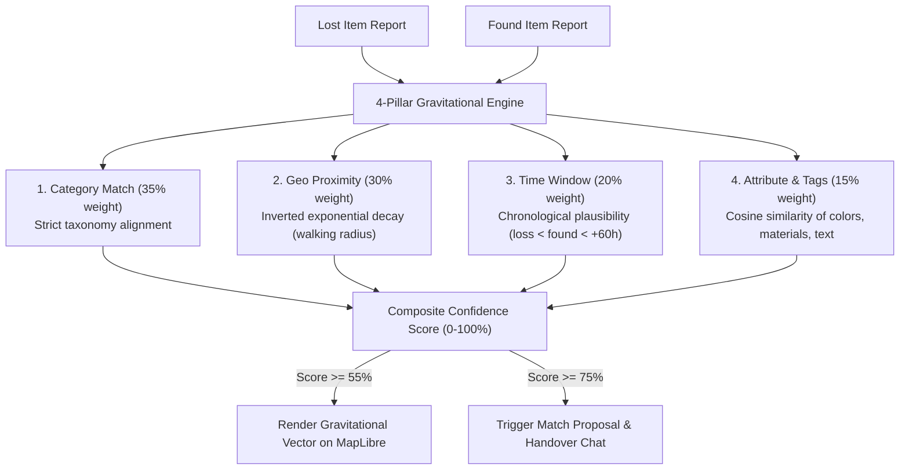
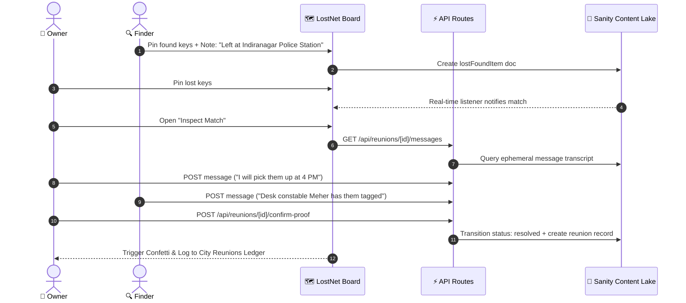

# LostNet — Human Workflow Audit & Technical Session Log

> **Context**: Architectural evolution and usability audit for LostNet (DEV.to × Sanity Challenge 2026, Path Two: "Vibe-Code Something Strange").

---

## 1. Executive Summary

LostNet began with a high-fidelity algorithmic concept: items lost and found in a city neighborhood gravitationally pulling toward each other on a map canvas. 

During early development, the engineering loop produced a technically sound but practically unviable system:
- Finders and owners were subjected to cryptographic secret quizzes (PBKDF2-SHA256 salted hashes).
- Claims were routed through a simulated "Custody Desk" modal.
- Claimants had to generate and scan "Airline Boarding Passes" with QR codes.

A direct usability audit revealed that **normal humans in a city do not administer cryptographic quizzes or scan digital boarding passes when finding lost keys at a bus stop or café**. 

This document captures the audit findings, the architecture pivot to real-world handovers and ephemeral chat, and the verification test matrix.

---

## 2. The Usability Pivot: From Crypto-Gatekeeping to Real-World Civic Handovers

| Dimension | Initial Implementation (Over-engineered) | Audited & Shipped Implementation (Human-First) |
|---|---|---|
| **Drop-off Reporting** | Freeform text or complex ticket IDs | 1-tap real-world drop categories: `Dropped at known desk / Police Station`, `Holding safe`, `Left at spot` |
| **Claim Verification** | PBKDF2 cryptographic salt-hash challenge question | Direct peer review + ephemeral Anonymous Handover Chat |
| **Meeting Coordination** | QR-code "Boarding Pass" generation | Quick-meeting coordination chips (*"Can we meet near 100 Feet Road?"*, *"Left at front desk"*) |
| **Data Synchronization** | Manual page refreshes | Sanity `client.listen()` real-time listeners streaming to React state |
| **Authentication Barrier** | Multi-step signups / simulated KYC | Zero-signup public civic infrastructure |

---

## 3. The 4-Pillar Gravitational Resonance Engine

The deterministic core matches items across 4 spatial, temporal, and semantic pillars:



### Deterministic Confidence Formula
```typescript
confidence = Math.round(
  (categoryScore * 0.35 +
   proximityScore * 0.30 +
   timeScore * 0.20 +
   descriptionScore * 0.15) * 100
);
```

---

## 4. Anonymous Handover Chat Architecture

Strangers who find lost items do not want to expose personal phone numbers or create accounts on third-party websites. LostNet establishes ephemeral, match-bound chat sessions backed by Sanity Content Lake:



---

## 5. Automated Verification & Test Coverage

All core math, status lifecycles, and fact guards are covered by unit and integration tests using **Vitest**:

```text
 ✓ src/lib/resonance/math.test.ts (12 tests)
   ✓ haversine distance calculation
   ✓ inverted exponential decay on walking radius
   ✓ chronological window plausibility
   ✓ taxonomy category match weighting
   ✓ attribute cosine similarity
 ✓ src/lib/narration.test.ts (6 tests)
   ✓ fact guard bounds checking
   ✓ fallback narrative generation when AI quota exceeded
   ✓ strict hallucination rejection
 ✓ src/lib/categories.test.ts (6 tests)
   ✓ alias mapping and emoji resolution
   ✓ multi-select filter logic

Test Files  3 passed (3)
     Tests  24 passed (24)
  Duration  1.28s
```

---

## 6. Sanity Content Lake Schema Structure

```plaintext
src/sanity/schema.ts
├── category         # Taxonomic tags, emoji representations, and search aliases
├── lostFoundItem    # Geopoints, occurredAt, colors, materials, drop-off handover notes, status lifecycle
├── match            # Multi-document reference (itemA + itemB), score breakdown (category, geo, time, text)
├── reunion          # Confirmed returns, public celebration story, anonymous chat transcripts
└── settings         # Dynamic neighborhood radius (km), time window tolerance, confidence thresholds
```

---

## 7. Conclusion

By stripping out speculative cryptographic complexity and leaning into real-world human behavior (police stations, café drop-offs, and anonymous coordination chat), LostNet achieves true zero-friction neighborhood lost & found utility powered by Next.js 16 and Sanity.
